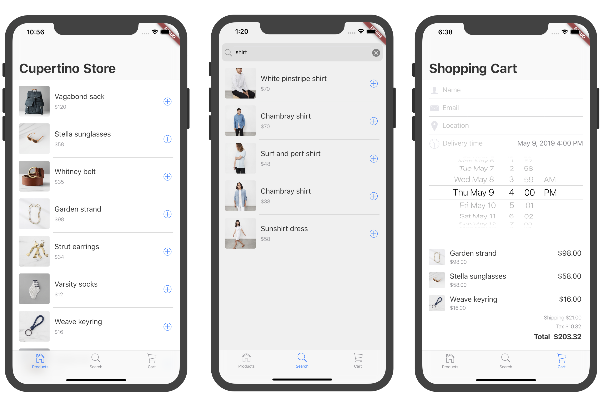

# Building a Cupertino App with Flutter

Flutter allows us creating Cupertino (iOS-style) apps that look and feel like native iOS apps.
To achieve that, Flutter ships with a set of Cupertino widgets that implement the current iOS design language based on Apple's Human Interface Guidelines.

The codelab is available here: https://codelabs.developers.google.com/codelabs/flutter-cupertino

The original codelab's source-code is available here: https://github.com/flutter/codelabs/tree/master/cupertino_store

During the codelab you will create a Cupertino style shopping app containing three tabs: one for the product list, one for a product search, and one for the shopping cart.

